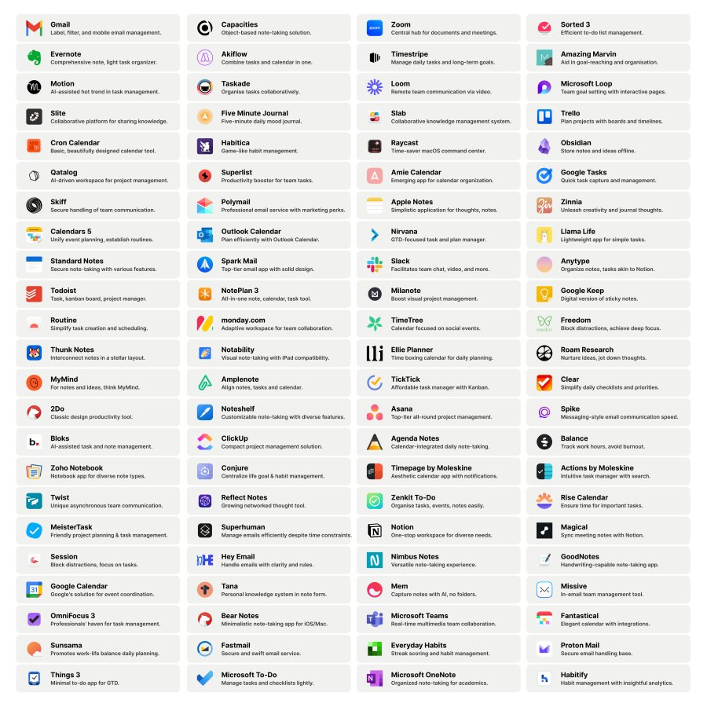
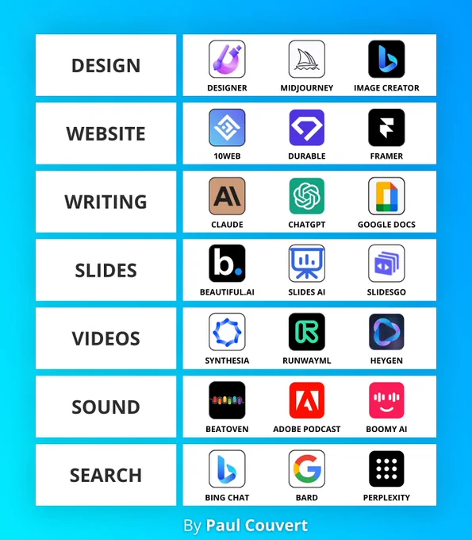

# BEST_REPOSITORY_FOR_ME_TO_LEARN_ANYTHING

<h1>Best Coding Platforms to practice your skills</h1> 

* HackerEarth: https://www.hackerearth.com/
* HackerRank: https://www.hackerrank.com/
* LeetCode: https://leetcode.com/
* Scaler Topics InterviewBit: https://www.scaler.com/
* Codechef: https://www.codechef.com/
* Codeforces: https://codeforces.com/
* Microsoft MakeCode: https://makecode.com
* Code Studio: https://www.pepcoding.com/
* FreeCodeCamp: https://www.freecodecamp.org/
* TopCoder: https://www.topcoder.com/
* SPOJ: https://www.spoj.com/
* Codecademy: https://www.codecademy.com/
* AtCoder: https://atcoder.jp/
* DMOJ: https://dmoj.ca/
* codingame: https://www.codingame.com/start
* codewars: https://www.codewars.com/
* coderbyte: https://www.coderbyte.com/
* projecteuler: https://www.projecteuler.net/
* interviewwbit: https://www.interviewbit.com/
* codeeval: https://www.codeeval.com/
* Microsoft Makecode: https://makecode.com
* GFG Practice: https://practice.geeksforgeeks.org/
* W3Schools: https://www.w3schools.com/
* TakeUForward: https://www.takeuforward.com/
* TutorialsPoint: https://www.tutorialspoint.com/index.htm
* Sololearn: https://www.sololearn.com/
* StudyTonight: https://www.studytonight.com/
* MDN Web Docs(best for Development): https://developer.mozilla.org/en-US/
* Roadmap.sh(All the roadmaps): https://roadmap.sh/
* Replit: https://replit.com/
* Codepen: https://codepen.io/

<h1>Good Resources for Competitive Programming</h1> 
  
* Algorithms for CP: https://cp-algorithms.com/index.html
* CSES Problem Set: https://cses.fi/problemset/
* Competitive Programming Topic-List: https://blog.shahjalalshohag.com/topic-list/
* USACO Guide: https://usaco.guide/dashboard/
* CLIST: https://clist.by/
* Codeforce Blog for CP: https://codeforces.com/blog/entry/111622
* Blog to reach Master: https://codeforces.com/blog/entry/97654
* CP Roadmap: https://drive.google.com/file/d/16Jydn250Ue7K7hOfzLxw4p5jFF4ZCqWT/view?pli=1
* Striver CP Sheet: https://takeuforward.org/interview-experience/strivers-cp-sheet/
* Errichto Algorithms - Youtube: https://www.youtube.com/@Errichto
* (tourist)Gennady Korotkevich - Youtube: https://www.youtube.com/@que_tourist
* Petr Mitrichev - Youtube: https://www.youtube.com/@petrmitrichev
* Luv - Good CP Series: https://www.youtube.com/@iamluv/featured
* Utkarsh Gupta: https://www.youtube.com/@utkarshgupta9858
* Priyansh Agarwal: https://www.youtube.com/@PriyanshAgarwal

<h1>Good Resources for Data Structures and Algorithms</h1> 

* Topic-Wise problems for Beginners: https://leetcode.com/discuss/career/448024/Topic-wise-problems-for-Beginners
* Striver’s SDE Sheet: https://takeuforward.org/interviews/strivers-sde-sheet-challenge-2023/
* Strivers A2Z DSA Course/Sheet: https://takeuforward.org/strivers-a2z-dsa-course/strivers-a2z-dsa-course-sheet-2/
* Take U Forward Youtube Channel: https://www.youtube.com/@takeUforward
* My Best resource - Leetcode: https://leetcode.com/explore/
* WilliamFiset - Youtube: https://www.youtube.com/@WilliamFiset-videos
* Knowledge Center: https://www.youtube.com/@KnowledgeCenter
* Pepcoding: https://www.youtube.com/@Pepcoding
* Aditya Verma - For DP: https://www.youtube.com/@CodeHelp/featured
* Abdul Bari: https://www.youtube.com/@abdul_bari/featured
* CodeHelp - by Babbar: https://www.youtube.com/@CodeHelp/featured
* c++ STL guide - Leetcode Section: https://leetcode.com/discuss/study-guide/1154632/c-stl-powerful-guide-compiled-list-of-popular-stl-operations

<h1>Learn CSS by playing games</h1> 

* Flexbox Froggy: https://flexboxfroggy.com
* Flexbox Defense: https://flexboxdefense.com
* CSS Grid Garden: https://cssgridgarden.com 
* FlukeOut: https://flukeout.github.io
* CSS Battle: https://cssbattle.dev
* Guess CSS: https://guess-css.app
* CSS Speedrun: https://css-speedrun.netlify.app
* Codepip: https://codepip.com

<h1>Improve your typing speed</h1> 

* TypeRacer: https://play.typeracer.com/
* MonkeyType: https://monkeytype.com/
* Keymash: https://keymash.io/

<h1>Tools and softwares which can help you to stay productive and focused</h1> 

* Pomodoro Timer(Manage your time): https://pomofocus.io/
* GoogleDrive(cloud storage): https://www.google.com/drive/
* Stackoverflow(Find bug solutions): https://stackoverflow.com/
* Vim(Command-line only Code editor): https://www.vim.org/
* Sublime Text(Lightweight Code editor): https://www.sublimetext.com/
* Visual Studio Code(Best Code editor): https://code.visualstudio.com/
* Major League Hacking: https://mlh.io/
* Devswag(Get swags and goodies): https://devswag.io/

* 92+ Productivity Tools:- 

<h1>Various AI Tools</h1> 

  *[100+ AI Tools](https://www.notion.so/ashcode98/List-of-100-AI-Tools-b4d5bc765a0646e09f8af7b0e95a86de?pvs=4)

<h1>Best YouTube Channels for Learning</h1> 

* [Take U forward (Best DSA content)](https://www.youtube.com/@takeUforward)
* [Siraj Raval - For AI](https://www.youtube.com/@SirajRaval/featured)
* [GFXMentor - One of the best for UI/UX design](https://www.youtube.com/@GFXMentor)
* [Gaurav Sen - One of the best for System Design](https://www.youtube.com/@gkcs)
* [pwnisher - Good VFX Tutorials](https://www.youtube.com/@pwnisher)
* [Krish Naik - One of the best for AI/ML](https://www.youtube.com/@krishnaik06)
* [Telusko - One of the best for Blockchain](https://www.youtube.com/@Telusko)
* [Traversy Media - One of the best for JavaScript](https://www.youtube.com/@TraversyMedia)
* [The Net Ninja - One of the best for Flutter](https://www.youtube.com/@NetNinja)
* [CrashCourse](https://www.youtube.com/@crashcourse)
* [freeCodeCamp](https://www.youtube.com/@freecodecamp)
* [Programming with Mosh](https://www.youtube.com/@programmingwithmosh)
* [NYU - Deep Learning Playlist](https://www.youtube.com/playlist?list=PLLHTzKZzVU9eaEyErdV26ikyolxOsz6mq)
* [Rachel Thomas Playlist](https://www.youtube.com/playlist?list=PLtmWHNX-gukKocXQOkQjuVxglSDYWsSh9)
* [Cornell Tech - Applied ML Playlist](https://www.youtube.com/playlist?list=PL2UML_KCiC0UlY7iCQDSiGDMovaupqc83)
* [CodeWithHarry](https://www.youtube.com/@CodeWithHarry)
* [Seed IT Solution](https://www.youtube.com/@seeditsolution7326)
* [Tanay Pratap](https://www.youtube.com/@tanaypratap)
* [Jenny's Lectures CS IT](https://www.youtube.com/@JennyslecturesCSIT)
* [GreatStack](https://www.youtube.com/@GreatStackDev)
* [WsCube Tech](https://www.youtube.com/@wscubetech/featured)
* [Tricky Man](https://www.youtube.com/@TrickyMan)
* [B Tecky](https://www.youtube.com/@btecky)
* [Hitesh Choudhary](https://www.youtube.com/@HiteshChoudharydotcom)
* [Kunal Kushwaha](https://www.youtube.com/@KunalKushwaha)
* [Crypto NWO](https://www.youtube.com/@CryptoNWO)
* [Engineering with Utsav](https://www.youtube.com/@EngineeringwithUtsav)
* [minutephysics](https://www.youtube.com/@MinutePhysics)
* [Veritasium](https://www.youtube.com/@veritasium)
* [Harkirat Singh](https://www.youtube.com/@harkirat1)
* [Arsh Goyal](https://www.youtube.com/@ArshGoyal)
* [Kunal Kushwaha Hindi](https://www.youtube.com/@KunalHindi)
* [WilliamFiset](https://www.youtube.com/@WilliamFiset-videos)
* [code_report](https://www.youtube.com/@code_report)
* [Tushar Roy - Coding Made Simple](https://www.youtube.com/@tusharroy2525/playlists)
* [Colin Galen](https://www.youtube.com/@ColinGalen/featured)
* [mycodeschool](https://www.youtube.com/@mycodeschool)
* [3Blue1Brown](https://www.youtube.com/@3blue1brown/featured)
* [Kartik Arora](https://www.youtube.com/@AlgosWithKartik)
* [Sanket Singh](https://www.youtube.com/@SanketSingh1/featured)
* [Computerphile](https://www.youtube.com/@Computerphile)
* [Neal Wu](https://www.youtube.com/@NealWuProgramming)
* [CodeBeyond](https://www.youtube.com/@CodeBeyond)
* [Vivek Gupta](https://www.youtube.com/@vivekgupta3484)
* [Clever Programmer](https://www.youtube.com/@CleverProgrammer)
* [Career With Gaurav](https://www.youtube.com/@careerwithgaurav)
* [CS Dojo](https://www.youtube.com/@CSDojo)

<h1>Helpful Notion Templates with Learning Resources</h1> 

* [150+ Learning resources](https://madzadev.notion.site/150-Learning-Resources-fbdc990809824560a0ccc36b5a42e04c)
* [220+ Developer courses](https://madzadev.notion.site/220-Developer-Courses-4c77af66c1424b22b9a62f26e6f4f0a3)
* [140+ Coding certificates](https://madzadev.notion.site/140-Coding-Certificates-71d5c0d70e1148a194eae80d82c976f0)
* [Web dev resources](https://www.notion.so/ashcode98/WEB-DEV-RESOURCES-c5350364ca8c4345b4b5f77271f18f94?pvs=4)
* [50+ Tools for Web Developers](https://www.notion.so/ashcode98/50-Awesome-Tools-for-Web-Developers-5d2ede5b379848d896004e82ce110c10?pvs=4)

<h1>Find various cheat-sheets for various programming languages and frameworks</h1> 

* [devhints.io](http://devhints.io/)
* [gitsheet.wtf](https://gitsheet.wtf/)
* [overapi.com](http://overapi.com/)
* [grid.malven.co](http://grid.malven.co/)
* [htmlreference.io](http://htmlreference.io/)
* [cheat-sheets.org](http://cheat-sheets.org/)
* [cheatography.com](http://cheatography.com/)
* [htmlcheatsheet.com](http://htmlcheatsheet.com/)
* [codehouse.vercel.app](https://codehouse.vercel.app/)
* [developer-cheatsheets.com](http://developer-cheatsheets.com/)
* [All-cheat-sheet.org](https://cheat-sheets.org/)

<h1>Free website hosting sites</h1> 

* InfinityFree: https://infinityfree.net
* FreeHosting: https://freehosting.com
* ByetHost: https://byet.host
* HyperPHP: http://hyperphp.com
* FreeWebHostingArea: https://freewebhostingarea.com
* Cwahi: http://cwahi.com
* 110MB: http://110mb.com
* Ripway: http://ripway.com
* SuperFreeHost: http://superfreehost.info
* FreeHostia: http://freehostia.com
* FreeWeb7: http://freeweb7.com
* T35: http://t35.com
* AwardSpace: http://awardspace.com
* PHPNET: http://phpnet.us
* FreeWebHostingPro: http://freewebhostingpro.com
* ProHosts: http://prohosts.org
* FreeZoka: http://freezoka.com

<h1>Build Your resume</h1> 

* 💼 [cvmkr.com](http://cvmkr.com/)
* 🎨 [enhancv.com](http://enhancv.com/)
* 📑 [flowcv.io](http://flowcv.io/)
* 🔍 [indeed.com/create-resume](http://indeed.com/create-resume)
* 🔍 [jobscan.co/resume-builder](http://jobscan.co/resume-builder)
* 📄 [kickresume.com](http://kickresume.com/)
* 📊 [livecareer.com](http://livecareer.com/)
* 📈 [myperfectresume.com](http://myperfectresume.com/)
* 🧩 [novoresume.com](http://novoresume.com/)
* 🤝 [resumecompanion.com](http://resumecompanion.com/)
* 🌟 [resumegenius.com](http://resumegenius.com/)
* 📝 [resume.io](http://resume.io/)
* 📈 [resumelab.com/in](http://resumelab.com/in)
* 📚 [resumenerd.com](http://resumenerd.com/)
* 📝 [resumonk.com](http://resumonk.com/)
* 📉 [rxresu.me](http://rxresu.me/)
* 🖥 [visualcv.com](http://visualcv.com/)
* 📄 [zety.com](http://zety.com/)

<h1>Find books related to computer science and it</h1> 

* [it-books](http://it-ebooks.info/)

<h1>Find various courses</h1> 

* Hacksnation: https://hacksnation.com.atlaq.com/
* Educative.io: https://www.educative.io/
* Free Computer Science Courses: https://www.coursera.org/browse/computer-science
* MIT OpenCourseWare: https://ocw.mit.edu/
* Class Central: https://www.classcentral.com/report/linkedin-learning-free-learning-paths/
* Coursera: https://www.coursera.org/
* edX: https://www.edx.org/
* Grok Academy: https://groklearning.com/
* Khan Academy: https://www.khanacademy.org/
* Open Culture: https://www.openculture.com/
* Udacity: https://learn.udacity.com/
* Udemy: https://www.udemy.com/
* CS50's Introduction to Computer Science: https://pll.harvard.edu/course/cs50-introduction-computer-science
* Computer Science 101: https://www.edx.org/learn/computer-science/stanford-university-computer-science-101
* Computational Thinking of Problem Solving: https://www.coursera.org/learn/computational-thinking-problem-solving
* Youtube - Computer Science: https://m.youtube.com/c/ComputerScienceLessons/playlists
* Introduction to Computer Science and Programming Using Python: https://www.edx.org/learn/python
* Algorithms: Design and Analysis: https://www.edx.org/learn/algorithms/stanford-university-algorithms-design-and-analysis-part-1
* AI for Everyone: https://www.coursera.org/learn/ai-for-everyone
* CS50’s intro to AI with Python: https://www.edx.org/learn/artificial-intelligence/harvard-university-cs50-s-introduction-to-artificial-intelligence-with-python
* ML Intro by Stanford: https://www.coursera.org/learn/machine-learning
* CS50’s Courses: https://pll.harvard.edu/course/cs50-introduction-computer-science
* Top Universities: https://www.networklawreview.org/
* Digitaldefynd: https://digitaldefynd.com/
* Theodinproject: https://www.theodinproject.com/
* Alison: https://alison.com/en
* Real.discount: https://www.real.discount/
* Great Learning: https://www.mygreatlearning.com/academy
* Learn Vern: https://www.learnvern.com/

<h1>miscellaneous</h1> 

* [Learn X in Y minutes](https://learnxinyminutes.com/)
* [Useful Tools and Softwares](https://www.notion.so/ashcode98/Resource-2-0-0b93bd45ec794716a5d2c306b10b10a2?pvs=4)